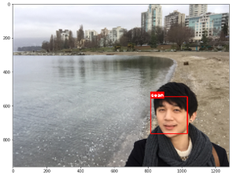

# TV_time_tracking_face_recognition

This project aims to build a tracker that measures the amount of time spent in front of TV of specifically registered individuals in a household.
Based on [Keras-OpenFace](https://github.com/iwantooxxoox/Keras-OpenFace), a project converting OpenFace from it's original Torch implementation to a Keras version, this tracker first crop and recognizes the faces of registered family members who are facing towards a camera on TV.
When TV is on, whenever the tracker recognizes the faces, a timer gets enabled for that person(s).    

## [TV_time_tracking_face_recognition Version 1 (TTT_v1)](https://github.com/sungsujaing/TV_time_tracking_face_recognition/blob/master/TV_time_tracking_face_recognition_v1.ipynb)
Face recognition on an image: based on the images registered in the database, TTT_v1 successfully recognize the face of the same person.

### Database registration process

### Face recognition example

