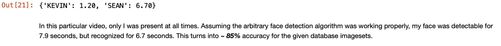
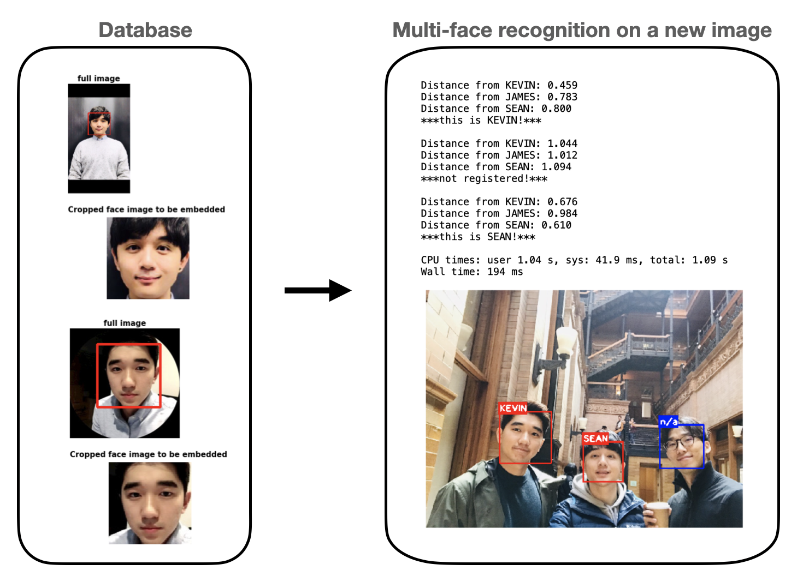
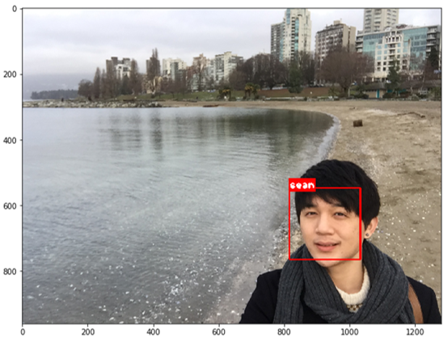

# TV_time_tracking_face_recognition

Wonder how much time we spend watching TV!
This project aims to build a tracker that measures the amount of time spent in front of the TV of specifically registered individuals in a household.
Developed on top of [Keras-OpenFace](https://github.com/iwantooxxoox/Keras-OpenFace), a project converting OpenFace from its original Torch implementation to a Keras version, 
this tracker recognizes the faces of registered family members who are facing a camera mounted on the TV and enable a timer.
When TV is on and whenever the tracker recognizes faces looking toward it, an individual timer gets enabled for that person(s).    

## [TV_time_tracking_face_recognition Version 3 (TTT_v3)](https://github.com/sungsujaing/TV_time_tracking_face_recognition/blob/master/TV_time_tracking_face_recognition_v3.ipynb)
Multi-face recognition on a video: based on the images stored in the database, TTT_v3 successfully recognizes registered faces on a video with great accuracy. In TTT_v3, the blue bounding boxes (for unregistered faces and falsely-detected faces) are not tracked as they are not needed for the purpose of the developing TV time tracker. Compared to TTT_v2, most helper functions were re-written for clarity and efficiency.

### TTT_v3 video face recognition example

---
### Upcoming for future TTT
* the model will be implemented to a real-time module. 
* the device will be mounted on a TV for a demo!
---
## [TV_time_tracking_face_recognition Version 2 (TTT_v2)](https://github.com/sungsujaing/TV_time_tracking_face_recognition/blob/master/TV_time_tracking_face_recognition_v2.ipynb)
Multi-face recognition on an image: based on the images stored in the database, TTT_v2 successfully recognizes registered faces on an image with great accuracy. TTT_v2 also differentiates registered faces from unregistered ones.

### TTT_v2 summary

### Differentiating registered (red) from unregistered (blue) faces

## [TV_time_tracking_face_recognition Version 1 (TTT_v1)](https://github.com/sungsujaing/TV_time_tracking_face_recognition/blob/master/TV_time_tracking_face_recognition_v1.ipynb)
Single face recognition on an image: based on the images registered in the database, TTT_v1 successfully recognize the face of the same person.

### Database registration process

### Face recognition example

### Limitation of TTT_v1: unable to detect/recognize multiple faces

